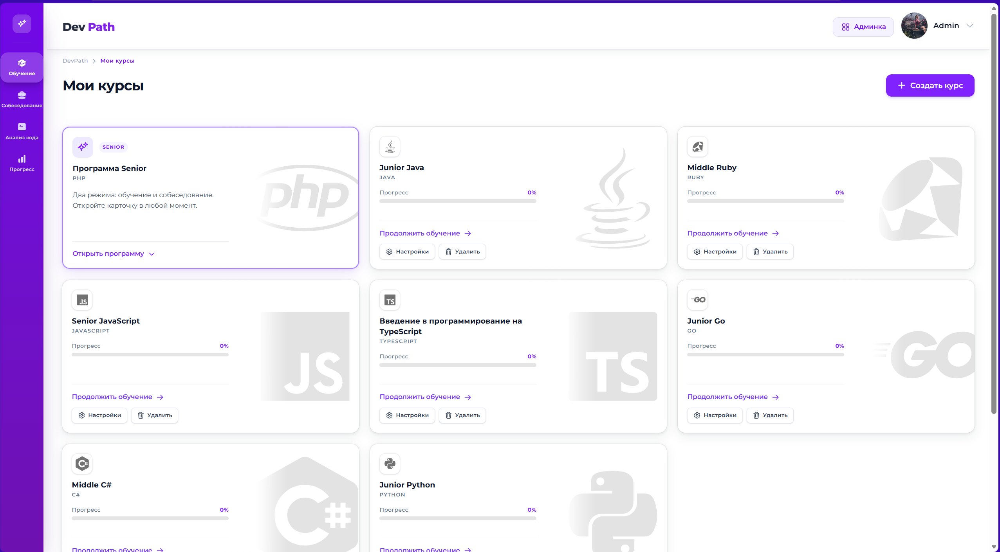
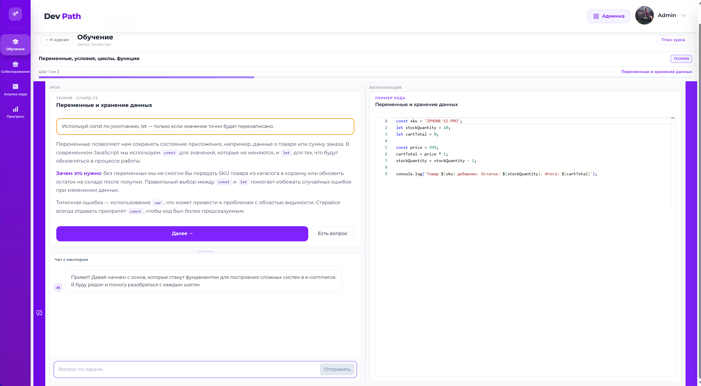
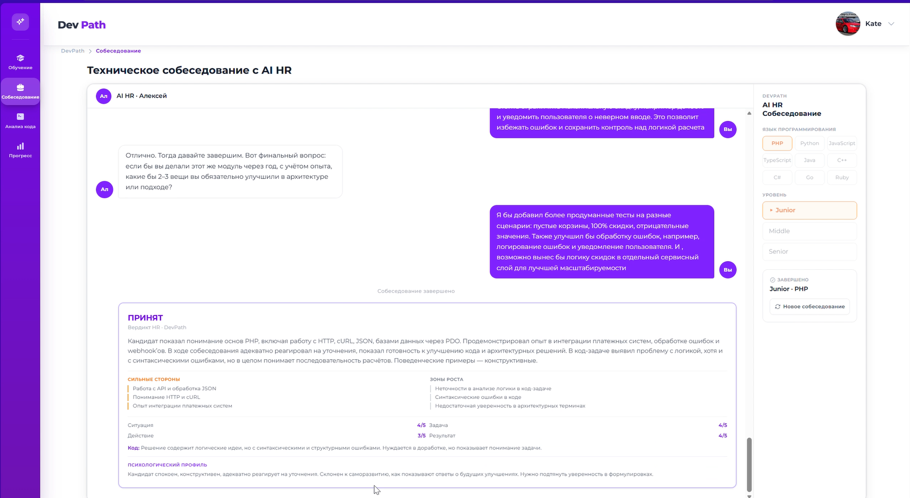
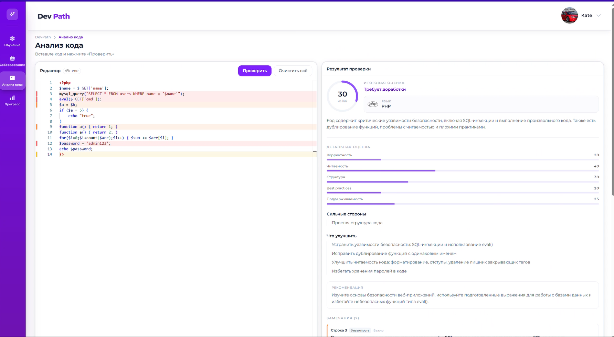
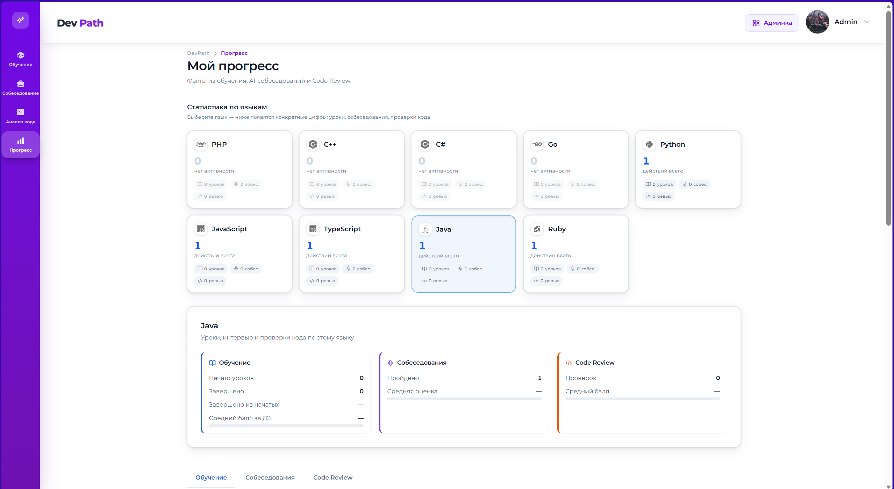
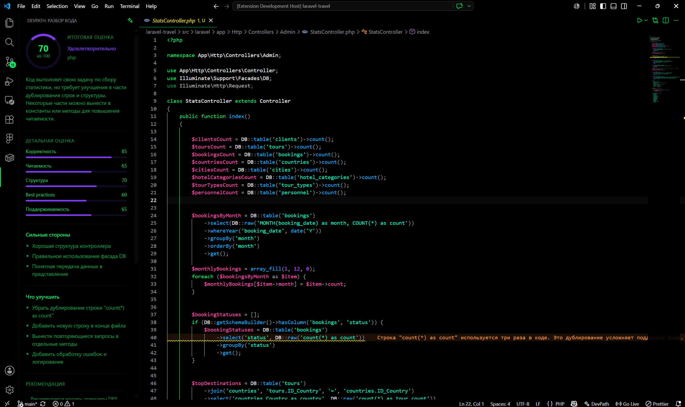

# DevPath — LMS с AI-наставником

Платформа персонализированного обучения программированию. Адаптивное тестирование, генерация уроков и анализ кода через LLM (Ollama + Qwen3-coder), симуляция HR-собеседований.

---

##  Скриншоты

### Главная

### Workspace урока — теория, практика и AI-ментор

### AI HR — симуляция технического собеседования

### Анализ кода — SonarQube + разбор от LLM

### Дашборд прогресса

### Плагин vs code

---

##  Возможности

- **Адаптивный входной тест (CAT):** генерация вопросов через LLM, динамическая подстройка сложности.
- **Персональный курс:** шаблон из админки + настройки студента (стиль, домен, персона ментора).
- **Workspace урока:** теория, практика в Monaco Editor, подсказки и чат с AI-ментором.
- **Анализ кода:** гибридный подход — статический анализ (SonarQube) + контекстная оценка LLM.
- **AI HR:** симуляция технического собеседования с задачами на код.
- **Админка (Filament):** управление шаблонами курсов, пользователями и ролями.

## Архитектура и стек

Модульный монолит с разделением на слои: Controllers → Services → Eloquent → PostgreSQL.

- **Backend:** PHP 8.4, Laravel 13, Eloquent ORM, PostgreSQL 15.
- **Frontend:** React 18, TypeScript, Inertia.js, Tailwind CSS, Monaco Editor.
- **Асинхронность:** Apache Kafka — 4 consumer-сервиса для AI-задач (CAT, уроки, анализ кода, HR).
- **AI и анализ:** Ollama (Qwen3-coder:480b-cloud) через Nginx reverse proxy; SonarQube для статического анализа кода студентов.
- **Инфраструктура:** Docker Compose, Prometheus, Grafana, Kafka UI.

### Требования
- Docker и Docker Compose
- 16+ ГБ RAM (Ollama + SonarQube + Kafka)
- OLLAMA_API_KEY (для облачной модели)

Полная инструкция по развёртыванию — в [DEPLOYMENT.md](DEPLOYMENT.md).

## Автор

**Kafka9092** — Fullstack Developer

kafka.dev9092@gmail.com

## Лицензия

Исходный код опубликован в образовательных и демонстрационных целях.
Коммерческое использование, распространение или создание производных 
продуктов без письменного разрешения автора запрещено.

All rights reserved.